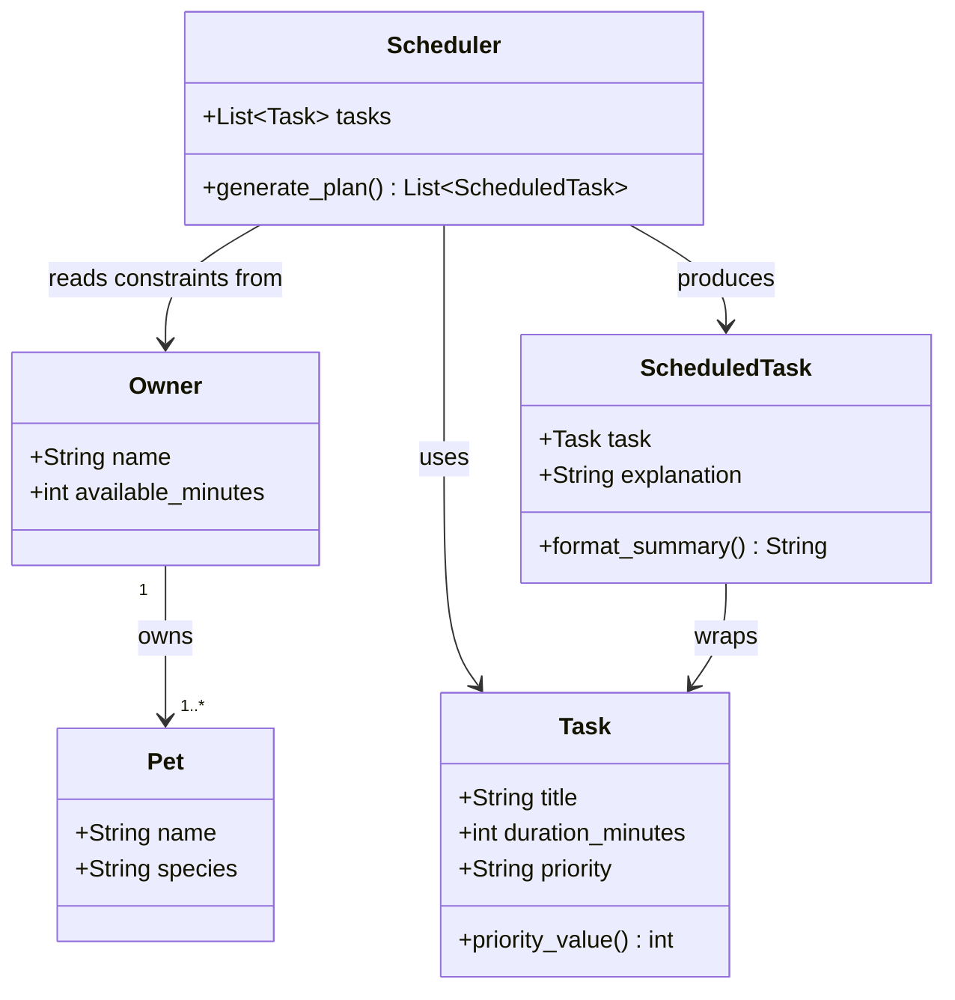

```mermaid
classDiagram
    class Owner {
        +String name
        +int available_minutes
    }

    class Pet {
        +String name
        +String species
    }

    class Task {
        +String title
        +int duration_minutes
        +String priority
        +priority_value() int
    }

    class Scheduler {
        +List~Task~ tasks
        +generate_plan() List~ScheduledTask~
    }

    class ScheduledTask {
        +Task task
        +String explanation
        +format_summary() String
    }

    Owner "1" --> "1..*" Pet : owns
    Scheduler --> Owner : reads constraints from
    Scheduler --> Task : uses
    Scheduler --> ScheduledTask : produces
    ScheduledTask --> Task : wraps
```
