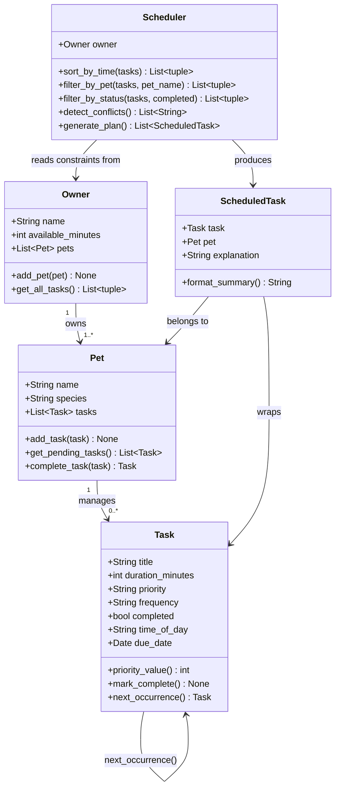

```mermaid
classDiagram
    class Task {
        +String title
        +int duration_minutes
        +String priority
        +String frequency
        +bool completed
        +String time_of_day
        +Date due_date
        +priority_value() int
        +mark_complete() None
        +next_occurrence() Task
    }

    class Pet {
        +String name
        +String species
        +List~Task~ tasks
        +add_task(task) None
        +get_pending_tasks() List~Task~
        +complete_task(task) Task
    }

    class Owner {
        +String name
        +int available_minutes
        +List~Pet~ pets
        +add_pet(pet) None
        +get_all_tasks() List~tuple~
    }

    class ScheduledTask {
        +Task task
        +Pet pet
        +String explanation
        +format_summary() String
    }

    class Scheduler {
        +Owner owner
        +sort_by_time(tasks) List~tuple~
        +filter_by_pet(tasks, pet_name) List~tuple~
        +filter_by_status(tasks, completed) List~tuple~
        +detect_conflicts() List~String~
        +generate_plan() List~ScheduledTask~
    }

    Owner "1" --> "1..*" Pet : owns
    Pet "1" --> "0..*" Task : manages
    Task --> Task : next_occurrence()
    Scheduler --> Owner : reads constraints from
    Scheduler --> ScheduledTask : produces
    ScheduledTask --> Task : wraps
    ScheduledTask --> Pet : belongs to
```
